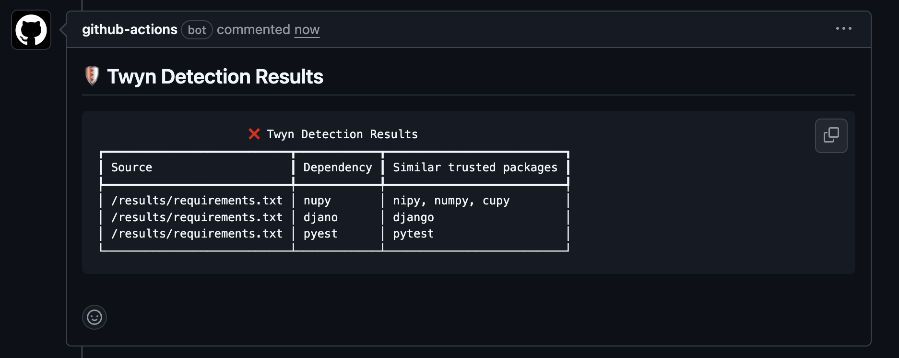

# Twyn Action

A GitHub Action that runs security checks against dependency typosquatting attacks using [Twyn](https://github.com/elementsinteractive/twyn).




## What is Twyn?

Twyn is a security tool that analyzes your project dependencies to detect potential typosquatting attacks - when malicious packages have names similar to legitimate ones to trick developers into installing them.

## Examples

### Basic Security Check

```yaml
  pull_request:
    branches: [ main ]

- name: Run Twyn Security Check
  uses: elementsinteractive/twyn-action@v1
  with:
    publish: true
    github-token: ${{ secrets.GITHUB_TOKEN }}
```

## Inputs

| Input | Description | Required | Default |
|-------|-------------|----------|---------|
| `dependency-file` | Dependency file(s) to analyze (comma-separated) | No | Auto-detect |
| `table` | Display results in table format (requires version >=v6) | No | `false` |
| `json` | Display results in JSON format | No | `false` |
| `publish` | Publish results as PR comments. It must run in a PR context | No | `false` |
| `github-token` | GitHub token for publishing comments | No | - |
| `recursive` | Recursively search for dependency files | No | `false` |
| `selector-method` | Method for selecting typosquats (`first-letter`, `nearby-letter`, `all`) | No | - |
| `v` | Enable verbose output | No | `false` |
| `vv` | Enable extra verbose output | No | `false` |
| `version` | Twyn version to use | No | `latest` |

## Outputs

| Output | Description |
|--------|-------------|
| `results` | Raw output from twyn scan |
| `exit-code` | Exit code |

## Publishing Results to PR

When `publish: true` is enabled, the action will automatically post a comment to the Pull Request with a formatted table showing any security findings.

**⚠️ Important: Publishing only works when the workflow runs in a Pull Request context.** Make sure your workflow is triggered by `pull_request` events, not just `push` or `workflow_dispatch`.

This requires:
- `table: true` (automatically enabled when publish is true)
- `version: "v6"` or higher (table format requires Twyn v6+)
- `github-token` to be provided
- The workflow to run on a Pull Request event (`on: pull_request`)

The PR comment will include a detailed table with information about potential typosquatting packages found.
